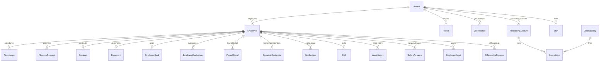

# Esquema Relacional y Especificación del Modelo de Datos Prisma (PostgreSQL)

## 1. Visión General del Modelo Relacional

La base de datos relacional PostgreSQL comprende entidades administradas mediante Prisma ORM. Las tablas utilizan convenciones de nombres en minúsculas en plural configuradas mediante la directiva `@@map`. Cada entidad principal posee el atributo `tenantId` para garantizar aislamiento por inquilino en un esquema compartido (*Shared Database, Shared Schema*).



---

## 2. Catálogo Técnico de Entidades Relacionales

### 2.1. Inquilinos y Multitenancy
1. **`Tenant` (`tenants`)**: Representa la empresa o inquilino en la plataforma SaaS. Atributos: `id` (cuid), `name`, `slug` (único), `ruc` (único), `plan` (`ESSENTIAL`, `GROWTH`, `ENTERPRISE`), `subscriptionStatus` (`TRIAL`, `ACTIVE`, `SUSPENDED`, `CANCELLED`), `maxEmployees`, `trialEndsAt`, `subscriptionEndsAt`, `isActive`, `createdAt`, `updatedAt`.

### 2.2. Núcleo de Empleados e Identidad
2. **`Employee` (`employees`)**: Ficha principal del colaborador. Atributos: `id` (cuid), `tenantId`, `firstName`, `lastName`, `email` (único), `password` (bcrypt hash), `department`, `position`, `salary` (cadena AES-256-GCM), `role` (`admin`, `hr`, `employee`, `accounting`), `identityCard`, `address`, `phone`, `birthDate`, `hireDate`, `civilStatus`, `contractType`, `accountNumber`, `accountType`, `bankName`, `vacationDays`, `isActive`, `workLatitude`, `workLongitude`, `geofenceRadius`, `enforceGeofence`, `trackingConsent`, `trackingConsentDate`, `resetPasswordToken`, `resetPasswordExpires`. Clave Única Compuesta: `[tenantId, identityCard]`.
3. **`Skill` (`skills`)**: Competencias laborales del colaborador. Atributos: `id`, `name`, `level`, `employeeId`.
4. **`WorkHistory` (`work_history`)**: Trayectoria profesional previa. Atributos: `id`, `company`, `position`, `startDate`, `endDate`, `description`, `employeeId`.

### 2.3. Control Asistencial, Horarios y Geofencing
5. **`Attendance` (`attendance`)**: Registro de marcas de entrada y salida con coordenadas GPS. Atributos: `id`, `date`, `checkIn`, `checkOut`, `workedHours`, `overtimeHours`, `status`, `entryLatitude`, `entryLongitude`, `exitLatitude`, `exitLongitude`, `breakStart`, `breakEnd`, `isLate`, `isEarlyDeparture`, `ipAddress`, `employeeId`. Clave Única: `[employeeId, date]`.
6. **`Shift` (`shifts`)**: Definición de turnos de trabajo. Atributos: `id`, `tenantId`, `name`, `startTime`, `endTime`, `breakMinutes`, `toleranceMinutes`.
7. **`EmployeeSchedule` (`employee_schedules`)**: Asignación de turnos a empleados. Atributos: `id`, `employeeId`, `shiftId`, `startDate`, `endDate`, `daysOfWeek`, `isActive`.
8. **`AbsenceRequest` (`absence_requests`)**: Solicitudes de permisos e incidencias. Atributos: `id`, `type`, `startDate`, `endDate`, `reason`, `status` (`PENDING`, `APPROVED`, `REJECTED`), `evidenceUrl`, `adminComment`, `employeeId`.

### 2.4. Contratos, Documentos y Nómina
9. **`Contract` (`contracts`)**: Registro de contratos de trabajo. Atributos: `id`, `type`, `startDate`, `endDate`, `salary`, `clauses`, `documentUrl`, `status`, `employeeId`.
10. **`Document` (`documents`)**: Archivos digitales del expediente. Atributos: `id`, `type`, `employeeId`, `documentUrl`, `expiryDate`, `mimeType`, `originalName`.
11. **`PayrollConfig` (`payroll_configs`)**: Parámetros de nómina por inquilino. Atributos: `id`, `tenantId`, `workingDays`, `currency`, `validFrom`, `isActive`.
12. **`PayrollItem` (`payroll_items`)**: Rubros imponibles o deducibles. Atributos: `id`, `name`, `type`, `isMandatory`, `percentage`, `fixedValue`, `configId`.
13. **`Payroll` (`payrolls`)**: Cabecera de emisión de nómina. Atributos: `id`, `tenantId`, `period`, `endDate`, `status`, `totalAmount`, `paymentDate`.
14. **`PayrollDetail` (`payroll_details`)**: Desglose individual de rol de pago. Atributos: `id`, `payrollId`, `employeeId`, `baseSalary`, `workedDays`, `overtimeHours`, `overtimeAmount`, `bonuses`, `deductions`, `netSalary`.
15. **`EmployeeBenefit` (`employee_benefits`)**: Beneficios corporativos activos. Atributos: `id`, `name`, `amount`, `type`, `frequency`, `status`, `employeeId`.

### 2.5. Evaluaciones de Desempeño y Objetivos
16. **`EvaluationTemplate` (`evaluation_templates`)**: Plantilla de evaluación de desempeño. Atributos: `id`, `tenantId`, `title`, `description`, `period`, `instructions`, `criteria`, `scale`, `isActive`.
17. **`EmployeeEvaluation` (`employee_evaluations`)**: Instancia de evaluación ejecutada. Atributos: `id`, `templateId`, `employeeId`, `startDate`, `endDate`, `status`, `finalScore`, `feedback`.
18. **`EvaluationReviewer` (`evaluation_reviewers`)**: Asignación de evaluador (Pares, Supervisor). Atributos: `id`, `evaluationId`, `reviewerId`, `status`, `responses`, `comments`, `score`, `completedAt`.
19. **`EmployeeGoal` (`employee_goals`)**: Objetivos estratégicos (OKRs / KPIs). Atributos: `id`, `employeeId`, `title`, `description`, `metric`, `targetValue`, `currentValue`, `unit`, `deadline`, `priority`, `status`, `progress`.

### 2.6. Reclutamiento, Selección y Clima Organizacional
20. **`JobVacancy` (`job_vacancies`)**: Ofertas de empleo publicadas. Atributos: `id`, `tenantId`, `title`, `department`, `description`, `requirements`, `benefits`, `salaryMin`, `salaryMax`, `currency`, `location`, `employmentType`, `deadline`, `status`, `postedById`.
21. **`JobApplication` (`job_applications`)**: Postulaciones recibidas. Atributos: `id`, `vacancyId`, `firstName`, `lastName`, `email`, `phone`, `resumeUrl`, `coverLetter`, `status`.
22. **`ApplicationNote` (`application_notes`)**: Notas internas del proceso de selección. Atributos: `id`, `applicationId`, `content`, `createdBy`, `createdById`.
23. **`Interview` (`interviews`)**: Entrevistas agendadas. Atributos: `id`, `applicationId`, `date`, `type`, `location`, `interviewerId`, `notes`, `status`.
24. **`CandidateEvaluation` (`candidate_evaluations`)**: Calificación de la entrevista. Atributos: `id`, `applicationId`, `evaluatorId`, `ratings`, `comments`, `recommendation`, `overallScore`.
25. **`ClimateSurvey` (`climate_surveys`)**: Encuestas de clima laboral. Atributos: `id`, `tenantId`, `title`, `startDate`, `endDate`, `isActive`, `description`.
26. **`ClimateResponse` (`climate_responses`)**: Respuestas anónimas recopiladas. Atributos: `id`, `surveyId`, `department`, `ratings`, `comments`, `npsScore`.

### 2.7. Seguridad, Auditoría y Biometría
27. **`AuditLog` (`audit_logs`)**: Registro inmutable de eventos de auditoría. Atributos: `id`, `tenantId`, `entity`, `entityId`, `action`, `userId`, `userEmail`, `details`, `ipAddress`, `createdAt`.
28. **`Notification` (`notifications`)**: Avisos in-app. Atributos: `id`, `employeeId`, `title`, `message`, `type`, `isRead`, `linkUrl`, `createdAt`.
29. **`NotificationPreference` (`notification_preferences`)**: Configuración de canales de alerta. Atributos: `id`, `employeeId`, `emailNotifications`, `pushNotifications`, `contractExpiryAlerts`, `payrollAlerts`.
30. **`SystemSetting` (`system_settings`)**: Parámetros del inquilino. Atributos: `id`, `tenantId`, `maintenanceMode`, `maintenanceMessage`, `biometricEnabled`, `allowedIPs`.
31. **`BiometricCredential` (`biometric_credentials`)**: Credenciales biométricas registradas. Atributos: `id`, `employeeId`, `biometricId`, `credentialType`, `templateHash`, `isActive`.

### 2.8. Contabilidad Financiera (Módulo `acc_*`)
32. **`AccountingPeriod` (`acc_periods`)**: Períodos contables. Atributos: `id`, `tenantId`, `year`, `month`, `startDate`, `endDate`, `status` (`OPEN`, `CLOSED`). Clave Única: `[tenantId, year, month]`.
33. **`AccountingAccount` (`acc_accounts`)**: Plan de cuentas. Atributos: `id`, `tenantId`, `code`, `name`, `type` (`ASSET`, `LIABILITY`, `EQUITY`, `REVENUE`, `EXPENSE`), `level`, `isTransactional`, `parentId`, `isActive`.
34. **`CostCenter` (`acc_cost_centers`)**: Centros de costo. Atributos: `id`, `tenantId`, `code`, `name`, `description`, `isActive`.
35. **`JournalEntry` (`acc_journal_entries`)**: Libro diario. Atributos: `id`, `tenantId`, `entryNumber`, `date`, `description`, `type`, `status`, `totalDebit`, `totalCredit`.
36. **`JournalLine` (`acc_journal_lines`)**: Apuntes contables de débito y crédito. Atributos: `id`, `journalEntryId`, `accountId`, `costCenterId`, `description`, `debit`, `credit`.

### 2.9. Anticipos, Activos, Offboarding y Comunicados
37. **`SalaryAdvance` (`salary_advances`)**: Solicitudes de anticipos de sueldo. Atributos: `id`, `employeeId`, `amount`, `installments`, `paidInstallments`, `monthlyQuota`, `reason`, `status` (`PENDING`, `APPROVED`, `REJECTED`, `PAID`).
38. **`EmployeeAsset` (`employee_assets`)**: Equipos y EPPs asignados. Atributos: `id`, `employeeId`, `name`, `serialNumber`, `category`, `condition`, `status` (`DELIVERED`, `RETURNED`, `LOST_DAMAGED`).
39. **`OffboardingProcess` (`offboarding_processes`)**: Proceso de desvinculación con finiquito calculado. Atributos: `id`, `employeeId`, `exitDate`, `causal` (`VOLUNTARY_RESIGNATION`, `UNFAIR_DISMISSAL`, `CONTRACT_END`, otros), `status` (`IN_PROGRESS`, `COMPLETED`), `checklist` (JSON serializado), `baseSalary`, `monthsWorked`, `thirteenthProportional`, `fourteenthProportional`, `vacationDaysOwed`, `vacationAmount`, `desahucioAmount`, `severanceAmount`, `totalSettlement`, `notes`.
40. **`Announcement` (`announcements`)**: Tablón de comunicados oficiales. Atributos: `id`, `tenantId`, `title`, `content`, `category`, `priority`, `requiresAcknowledgment`, `attachmentUrl`.
41. **`AnnouncementRead` (`announcement_reads`)**: Acuses de recibo digital. Atributos: `id`, `announcementId`, `employeeId`, `readAt`, `acknowledged`. Clave Única: `[announcementId, employeeId]`.

---

## 3. Aislamiento Multi-Tenant en la Capa de Datos

El aislamiento entre empresas se implementa mediante un interceptor Prisma (`$use`) en `database/db.js`. Este middleware intercepta **todas** las operaciones de la ORM antes de ejecutarlas en PostgreSQL y agrega automáticamente los filtros correspondientes.

### 3.1 Clasificación de Modelos para el Interceptor

| Categoría | Modelos | Mecanismo de Filtro |
|-----------|---------|---------------------|
| Directos | Employee, Shift, Payroll, PayrollConfig, AccountingPeriod, AccountingAccount, CostCenter, JournalEntry, JobVacancy, ClimateSurvey, EvaluationTemplate, Announcement, AuditLog, SystemSetting | `WHERE tenantId = ?` |
| Relacionales vía Employee | Contract, Attendance, AbsenceRequest, EmployeeBenefit, SalaryAdvance, EmployeeEvaluation, Document, Skill, WorkHistory, EmployeeGoal, EmployeeAsset, OffboardingProcess, BiometricCredential, Notification, NotificationPreference, EmployeeSchedule, AnnouncementRead | `WHERE employee.tenantId = ?` |
| Indirectos | PayrollDetail, PayrollItem, JobApplication, Interview, CandidateEvaluation, ClimateResponse, JournalLine | Filtro jerárquico (ej: `WHERE payroll.tenantId = ?`) |

### 3.2 Operaciones Interceptadas

| Operación Prisma | Acción del Interceptor |
|-----------------|----------------------|
| `findUnique` / `findUniqueOrThrow` | Transforma a `findFirst` con filtro de tenant + expansión de compound keys |
| `findMany` / `findFirst` / `count` / `groupBy` / `aggregate` | Inyecta `where.tenantId` si no está ya presente |
| `create` | Inyecta `data.tenantId` en modelos directos; valida ownership del `employeeId` en modelos relacionales |
| `createMany` | Inyecta `tenantId` en cada elemento del array |
| `updateMany` / `deleteMany` | Inyecta `where.tenantId` |
| `update` / `delete` | Verifica existencia del registro con `findFirst` usando filtro de tenant antes de la mutación |

### 3.3 Bypass de Filtro para Verificaciones Internas

La función `runWithoutTenantFilter(callback)` desactiva temporalmente el interceptor dentro de su scope. Se usa exclusivamente para verificaciones de existencia previas a mutaciones, evitando la recursión infinita del interceptor interceptando sus propias consultas de validación.

```javascript
// En el interceptor — verificación previa a update/delete
const existing = await runWithoutTenantFilter(() =>
    prisma[delegateName].findFirst({ where: whereWithTenantFilter })
);
if (!existing) throw new Error('Acceso Denegado (Multi-Tenant)');
```
